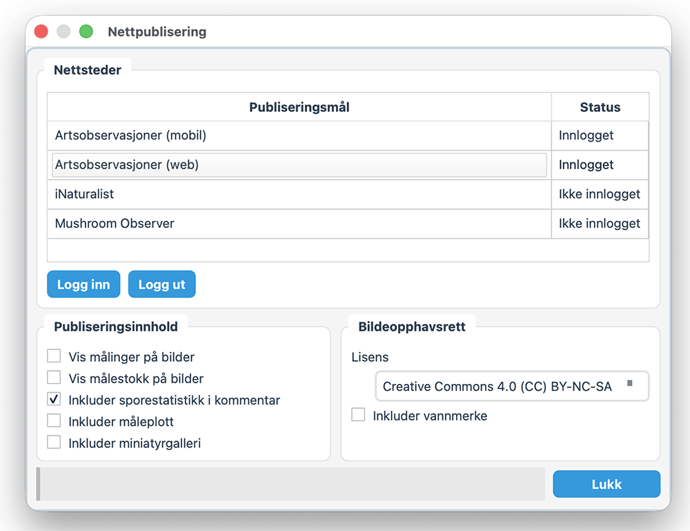

# Online Publishing

Publish observations from Sporely to Artsobservasjoner, iNaturalist, Mushroom Observer, and Sporely Cloud via **Settings → Online publishing**.

## Logging in

1. Open **Settings → Online publishing**.
2. Select a service in the table.
3. Click **Log in**.

## Publishing options
You can set the image license for uploaded images and choose which generated media to include.

Available content options:
- show measures on images
- show scale bar on images
- include spore stats in comment
- include measure plot
- include thumbnail gallery
- include plate

For image uploads, only the images with checked boxes in the observation gallery are used.

### Artsobservasjoner

Logging in to either Artsobservasjoner target logs in to both (mobile and web) in one step. Enter your username and password when prompted. Tick **Save login info on this device** to avoid being asked again — credentials are stored securely via the OS keyring.

If your session expires, Sporely will silently re-authenticate in the background using saved credentials.

### iNaturalist (awaiting approval)

Click **Log in** and complete sign-in in your browser. Sporely keeps you signed in afterwards.

### Mushroom Observer

Click **Log in** and enter your Mushroom Observer user API key.

### Sporely Cloud

Go to **Settings → Profile & Cloud**, click **Log in**, and sign in with your Sporely Cloud account. If you enable **Save password on this device**, Sporely stores the password securely in the OS keyring.

Sporely Cloud and Artsobservasjoner are separate services with separate login/session handling.

The local database is linked to the first Sporely Cloud account it syncs with. Later login attempts for a different cloud account are blocked until you explicitly reset/migrate the cloud link, preventing the same local data from being duplicated across multiple cloud accounts.

The Profile & Cloud page also edits the shared Sporely profile (`username`, display name, bio, and avatar). When signed in, the local profile email follows the Sporely Cloud account email.

Cloud sync does not use the online-publishing overlay options. On desktop:
- only checked observation-gallery images are uploaded
- synced images can be sent either at full size or reduced to 2 MP
- images and thumbnails uploaded to Sporely Cloud stay clean: no watermark, scale bar, measure overlay, plot, plate, or gallery mosaic is added

If you change publish-image selection, image order, image metadata, measurements/spore stats, or local image files, the affected observation is marked for cloud re-sync so cloud media stays up to date after the first upload.

After the first clean cloud media sync for an observation, later startup syncs try a lightweight local signature check first. If the selected images, measurements, and relevant publish settings have not changed, Sporely skips gallery/plot/media preparation and does not re-upload unchanged cloud media.

If the same linked observation changed on both desktop and web since the last synced snapshot, Sporely now skips the automatic overwrite and reports a conflict instead of silently replacing one side.

When that happens, Sporely opens a conflict review dialog with a side-by-side comparison of the changed fields plus desktop/cloud change summaries. You can then choose **Keep desktop** or **Keep cloud** for each conflicted observation.

The cloud visibility level is set globally in Profile & Cloud with **Default sharing**. It is stored in the cloud as the `visibility` field.

## Publishing an observation

1. Go to **Observations**.
2. Select one or more rows.
3. Click **Publish** and choose a target.

Artsobservasjoner targets are greyed out for observations that have already been uploaded there. iNaturalist and Mushroom Observer can still be used for those.

Sporely Cloud sync runs automatically on startup and when you click **Refresh** in the Observations tab, as long as you are logged in.

## Requirements

### Artsobservasjoner

- Genus and species set.
- Observation date.
- GPS coordinates.
- At least one image.

### iNaturalist

- Observation date.
- GPS coordinates.
- At least one image.

## See also

- [Database structure](./database-structure.md)
- [Taxonomy integration](./taxonomy-integration.md)
- [Field photography](./field-photography.md)
- [Microscopy workflow](./microscopy-workflow.md)
