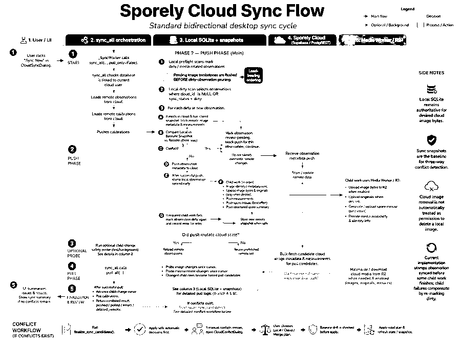

# Cloud Sync Architecture Map

Status: navigation/implementation document, written August 2026 against
`utils/cloud_sync.py` at 24,163 lines (13 top-level classes, ~447 top-level
functions, ~142 methods).

This document explains **how the current implementation is organized** so a
developer or agent can find the canonical owner of any sync concern before
changing it. The **behavioral specification** remains
[`supabase-sync-contract.md`](supabase-sync-contract.md) — if this document
and the contract ever disagree, the contract wins and this document must be
fixed.

Line numbers refer to `utils/cloud_sync.py` unless another file is named.
They will drift; symbol names are the stable reference. Verify with
`grep -n "def <name>" utils/cloud_sync.py`.


## Visual overview



This diagram summarizes the standard bidirectional desktop sync cycle: push
preflight and tombstone ordering, three-way conflict detection, image and
measurement child work, the optional child-change probe, pull reconciliation,
retry/error paths, and interactive conflict resolution. It is an orientation
aid; the sync contract, current code, and tests remain authoritative if the
diagram drifts.

---

## A. System purpose and boundaries

Sporely desktop is local-first. Cloud sync copies shared scientific data
between the desktop SQLite database and Sporely Cloud without silently
destroying local files, cloud photos, or work from another device.

| Store | What it holds | Who owns it |
| --- | --- | --- |
| **Local SQLite** (`database/`) | Observations, images, measurements, calibrations, settings, tombstones, sync snapshots. **Authoritative for whether individual image bytes are desired in Sporely Cloud** (`sporely_cloud_image_storage_excluded_ids_<obs>` settings keys). | Desktop |
| **Supabase/Postgres** | Shared observation/image/measurement/calibration metadata rows (`observations`, `observation_images`, `spore_measurements`, calibration tables). Accessed via PostgREST. | Shared; RLS-scoped per user |
| **R2 via media Worker** | Image bytes (web-friendly derivatives, optional companion originals, mosaics, calibration references). Normal desktop sync always goes through the authenticated Cloudflare Worker, never direct R2 (see `_storage_remove`, L14796, and `README.md`). | Cloud |
| **Sync snapshots** | The last state both sides agreed on, per observation, stored in local settings. Basis for three-way comparison. | Desktop |
| **Local originals** | Full-quality files imported on desktop. A smaller cloud copy never overwrites a better local original. | Desktop |
| **Cloud recovery cache** | Files downloaded from cloud (`source_role=cloud_recovery_cache` / `file_purpose=cache`). Remote-owned copies; their bytes must never be re-uploaded. | Cloud (mirrored locally) |
| **Metadata-only microscope anchors** | Cloud `observation_images` rows with `storage_path IS NULL AND image_type='microscope'`. Valid rows that carry measurement links and public-spore-mosaic anchoring **without image bytes**. Not broken; not deleted. | Shared |
| **Tombstones** (`image_tombstones` table) | Durable evidence of an explicit user deletion. The only legitimate source of cloud-deletion intent. | Desktop |

Sibling modules that share sync responsibility (do **not** assume
`cloud_sync.py` is the whole implementation):

| Module | Responsibility |
| --- | --- |
| `utils/cloud_media_policy.py` | Field/microscope byte-eligibility policy helpers |
| `utils/original_sync_policy.py` | Opt-in full-resolution original upload policy |
| `utils/cloud_media_recovery.py` | Plan/apply pipeline for repairing broken cloud image rows |
| `utils/cloud_media_audit.py` | Read-only audit of cloud media rows vs storage objects |
| `utils/cloud_spore_mosaic.py`, `utils/cloud_spore_mosaic_backfill.py` | Spore-mosaic derivative sync and backfill |
| `utils/spore_summary_sync.py` | Spore-summary derivative push/pull |
| `utils/reference_cloud_sync.py` | Normalized-reference sibling executor and typed result. It stages all four owner feeds, reconciles library dependencies before observation uses, then delegates immutable curated-fork provenance reconciliation; normal sync executes deterministic CAS pushes and pull-only stops after reads/reconciliation. |
| `utils/curated_reference_sync.py` | Stage 6k owner-private curated-fork provenance sync. It runs after personal graph reconciliation, validates exact public bundle identity/fingerprint, and never mutates fork content or observation attachments. |
| `database/curated_reference_forks.py` | Shared-reference contribution read/copy boundary. The historical module name remains for compatibility; public results are owner-attributed immutable contribution revisions, and copying creates fresh owner-private identities rather than a shared mutable record. |
| `database/reference_sync_state.py` | Stage 4 normalized-reference transport repository. It stores account-bound baselines, row versions, retry/conflict state, durable deletion intent, and atomic acknowledgement/restore transitions in the owning database. |
| `database/reference_sync_planner.py` | Pure Stage 4c normalized-reference graph planner and read-only durable snapshot loader. It orders live work parent-first and tombstones child-first and reports dependency/account/conflict blocks without network activity. |
| `database/reference_use_sync_reconciliation.py` | Stage 4g complete-feed observation-use reconciliation. It preserves frozen snapshots, maps verified observation identities, and applies baseline-aware updates/tombstones without rebuilding evidence. |
| `utils/reference_cloud_adapter.py` | Typed boundary over the four normalized-reference RPC writers and four completely paginated owner readers. It validates payloads/results and classifies transport failures without planning or persistence policy. |
| `utils/reference_client_capabilities.py` | Stage M reference client capability: per-profile device id, the declared `reference_snapshot_versions` (derived from the shipped v2 readers), the once-per-session device report, and the capability-hold fingerprint/marker used by the executor for `requires_newer_client` / `older_client_active`. Owner sets, uses and curated forks are read through `list_reference_library_feed` full pulls (`SporelyCloudClient._list_reference_library_feed`). |
| `utils/r2_storage.py` | Low-level R2/Worker storage adapter |

Normalized reference transport state is deliberately separate from the domain
tables. Works, treatments, and measurement sets use
`reference_cloud_sync_state` / `reference_cloud_tombstones` in
`reference_values.db`; observation uses use
`observation_reference_use_cloud_sync_state` /
`observation_reference_use_cloud_tombstones` in `mushrooms.db`. Schema triggers
create initial state and capture deletion intent in the same transaction as
domain mutation, including observation-parent cascades. Full backups retain
these tables; portable exports exclude them. Mutation ownership, graph
planning, and the four-entity executor remain separate from legacy
observation/media/calibration ownership. `sync_all` invokes the facade only
after its legacy observation pull has established cloud identities.

Application mutations are owned by the repositories in
`database/reference_library.py`; their update paths record transport intent in
the same SQLite transaction. Insert/delete intent remains trigger-owned so
direct observation cascades cannot bypass it. Archive import revision upgrades
are the documented repository bypass and call the same connection-scoped
intent helpers. The reference facade executes a fresh plan for each normal
sync. It first stages complete work, treatment, measurement-set, and
observation-use owner feeds. It reconciles the library in its owning database,
then uses after verified observation identity and source convergence. Live rows are
applied parent-first, explicit remote tombstones child-first, and per-table
`(updated_at,id)` cursors advance only with the successful graph commit.
Three-way comparison against accepted baselines preserves local-only changes,
auto-merges only disjoint fields, and records overlapping/delete conflicts.
Remote tombstone markers retain restore CAS tokens without becoming outbound
delete intent. Use pulls preserve the remote frozen snapshot verbatim and
three-way merge only non-overlapping role/note changes. The facade then
persists every push acknowledgement before replanning, orders measurement-set
successors after their acknowledged predecessors, and is called after legacy
observation and calibration pulls. Acknowledgement
transitions atomically follow a row into a concurrent tombstone or same-ID
recreation so restart cannot strand a stale delete token.

The named reference writer methods on `SporelyCloudClient` are registered as
pull-only blocked operations; the four owner readers are explicitly allowed.
Readers select an allowlisted row shape and paginate in
`updated_at.asc,id.asc` order. Stage 4g consumes all four complete owner feeds
before any local apply; the executor also uses a relevant reader to reconcile
ambiguous create outcomes before retrying. In pull-only mode the facade
receives the fail-closed wrapper, reads and reconciles all four complete feeds,
and returns before any push planning or writer call.

The Stage 6k provenance writer is separately named and pull-only blocked. Its
owner feed and exact public revision reader are explicitly read-allowed. The
mapping is not a fifth mutable graph entity: it is immutable origin metadata
whose three personal UUID dependencies must already form one owner graph.

Shared publication is owned by the cloud database rather than by another
desktop sync planner. After an authenticated observation-reference use is
synced for an exact species taxon, a database trigger publishes or revises the
owner-attributed immutable contribution envelope. The public contribution
readers are pull-only allowed; the explicit share/withdraw writers are
pull-only blocked. DOI and other citation fields are evidence, never identity:
two owners can contribute independent records with the same DOI. Other users
can only read a contribution or copy its frozen revision into fresh local UUIDs.
The older reviewer/publisher/attestation RPCs remain legacy implementation
surface and are not part of this publication path.
Taxon reassignment and removal of the last synced use withdraw stale discovery;
the cloud handles service-owned taxonomy resolution and hard-delete cascades as
well as authenticated use updates. Abuse/privacy/legal moderation is an
independent visibility flag and cannot be undone by owner withdrawal or
resharing. Account deletion retains immutable revision records while removing
owner/source identifiers and replacing frozen attribution with a deleted-user
label.

---

## B. Sync modes / entry points

All entry points are top-level functions in `utils/cloud_sync.py`.

### Normal bidirectional sync

`sync_all(client, sync_images=…, materialize_remote_images=…, full_pull=…, child_safety_pull=…, pull_only=False)` (L6082)

```
sync_all()
  -> ensure_database_linked_to_cloud_user()
  -> client.list_remote_observations()        # paginated
  -> client.list_remote_calibrations()        # paginated
  -> push_calibrations()                      (calibrations.py)
  -> push_all()                               (L17631)
       -> _mark_cloud_observations_dirty_for_media_changes()            (L8465)
       -> _mark_cloud_observations_dirty_for_image_capture_time_changes() (L8477)
       -> _mark_cloud_observations_dirty_for_pending_local_images()     (L8845, gated scan)
       -> _push_pending_image_tombstones()    (L5814, flushed BEFORE pruning)
       -> per dirty observation:
            _analyze_observation_push_conflicts()  (preflight.py)
            client.push_observation()              (L15120)
            _push_images_for_observation()         (incl. desired-state init, identity repair, uploads)
            measurement / summary push
            _store_remote_snapshot() then _stamp_observation_synced()
  -> child-change probe                       # (updated_at,id) keyset over
       list_image_changes_since()             #   observation_images +
       list_measurement_changes_since()       #   spore_measurements legs
  -> pull_all(forced_pull_cloud_ids=…)        (L22251)
  -> advance child-change cursor              # only after pull_all succeeds
  -> pull_calibrations()
  -> sync_reference_library()                 # pull graph, then CAS push
```

The child-change probe detects cloud-side child edits whose parent
observation is otherwise unchanged. Parents of changed child rows go to
`pull_all` as `forced_pull_cloud_ids` (bypassing unchanged-observation
pruning for exactly those observations); the per-leg `(ts, id)` cursor
(v2, in app settings) advances to the maximum inspected tuple with numeric
id ordering (`_child_change_cursor_id_key`) only after `pull_all` succeeds.
Contract details: `supabase-sync-contract.md`, "Child-change detection".

The three flags `sync_images`, `materialize_remote_images`, `full_pull` are
independent controls with caller-mode rules documented in `AGENTS.md`
("Cloud sync invariants"). Never treat "all three on" as a generic full sync.

### Push-only / pull-only building blocks

- `push_all(client, …)` (L17631) — pushes dirty observations, images,
  measurements, tombstones.
- `pull_all(client, …, full_pull=…, pull_only=False)` (L22251) — pulls
  new/changed remote observations, applies remote updates to clean local
  rows, materializes remote media. `full_pull=False` is the no-op fast path
  (prunes candidates by `updated_at` vs `synced_at`).

### Download from Cloud (strict pull-only)

`sync_all(pull_only=True)` (branch at L6120):

```
sync_all(pull_only=True)
  -> PullOnlyCloudClient(client)              (L2170, fail-closed wrapper)
  -> pull_only_client.list_remote_observations()
  -> pull_all(pull_only_client, full_pull=True, pull_only=True)
  -> sync_reference_library(pull_only_client, pull_only=True)
       -> four complete paginated owner reads; no reference writer
  -> result: pushed=0, cloud_writes_completed=0,
             blocked_write_attempts=list(wrapper.write_attempts)
```

Both push phases are skipped entirely; the pull implementation is shared
with normal sync (no parallel engine). `pull_all` honours the wrapper's
`is_pull_only` marker even if the caller forgot `pull_only=True` (L22280),
and source-gates its own write paths (e.g. EXIF backfill PATCH skipped at
L22288). See section D for the write-boundary rule.

Both modes attach a `reference_sync` result object containing separate
`pushed`, `pulled`, `errors`, `retryable_errors`, `terminal_errors`,
`conflicts`, and `blocked` fields. Legacy top-level observation/calibration
counts retain their existing meaning. Actionable reference errors, conflicts,
and blocks are also appended to the top-level `errors` list so existing UI
error handling cannot report a false success.

### Calibration sync

- `push_calibrations(client, …)` (`utils/cloud_sync_impl/calibrations.py`) →
  `client.push_calibration_metadata()` (L15086),
  `client.push_calibration_reference_image()` (L14955).
- `pull_calibrations(client, …)` (`utils/cloud_sync_impl/calibrations.py`).
- Conflict tools: `list_calibration_conflicts` (`utils/cloud_sync_impl/calibrations.py`),
  `repair_calibrations_local_wins` (`utils/cloud_sync_impl/calibrations.py`).
- `download_calibration_reference_to_cache` (L947).

### Measurement sync

Runs inside observation push/pull, not as a separate top-level mode:

- Pull: `client.pull_measurements_for_images()` (L15812, paginated + batched),
  applied per observation; identity prefetch via
  `fetch_remote_measurement_identity_cache` (L9062).
- Push: `client.push_measurement()` (L15968, upsert with no-op detection),
  `client.set_measurement_desktop_id()` (L15805),
  `client.delete_cloud_measurements_for_image()` (L16063).

### Image / media sync

Inside `push_all` / `pull_all`:

- Push: `_push_images_for_observation` (desired-state init → identity repair
  → tombstone-safe candidate filtering → `upload_image_file` /
  `upload_original_image_file` → `push_image_metadata`).
- Push fast-path gate (in `push_all`, `sync_images=True` only): storage-intent
  init + `_pending_cloud_pushable_image_ids` decide *upload completeness*,
  which is separate from render-signature equality and vetoes the
  `image_render_unchanged` / tombstone-only / metadata-only image-prep
  branches. See "Image-prep fast paths require upload completeness" in
  `docs/supabase-sync-contract.md`.
- Pull/materialize: bulk metadata via `pull_bulk_image_metadata` (L15865),
  byte download via `download_image_file` (L16127), local application /
  materialization helpers around L10168–L10513.

### Recovery / audit / migration paths

- `recover_full_original_for_image` (L1250) — explicit, user-driven original
  recovery (uses `recovery_authorized=True` upload opt-in where applicable).
- `utils/cloud_media_recovery.py` — plan/apply repair of broken cloud rows.
- `utils/cloud_media_audit.py` + `scripts/audit_cloud_media.py` — read-only
  audit (see `docs/cloud-media-incident-audit.md`).
- `backfill_public_spore_mosaics` (L21839),
  `diagnose_public_spore_mosaic_gates` (L20992).

### Conflict resolution surface

```
finalize_sync_candidates()          (L10825)
build_conflict_plan_baseline()      (L11459)
resolve_conflict_plan()             (L13337)
resolve_conflict_keep_local()       (L11118)
resolve_conflict_keep_cloud()       (L11249)
resolve_conflict_merge()            (L11310)
get_conflict_detail()               (L16687)
```

### Other public state-mutation entry points (called from UI)

- `set_image_cloud_selected(image_id, selected)` (L7402) — THE entry point
  for the "Keep image in Sporely Cloud" checkbox; owns the
  excluded-set + tombstone-queue/cancel lifecycle.
- `remember_explicit_image_restore_source` (`utils/cloud_sync_impl/sync_state.py`).
- `mark_observation_dirty` (`utils/cloud_sync_impl/sync_state.py`), `mark_observation_media_dirty` (`utils/cloud_sync_impl/sync_state.py`).
- `unlink_local_observation_from_cloud` (L7322).

---

## C. Function ownership / canonical functions

"If I need to change X, what function owns X?"

| Concern | Canonical function(s) | Responsibility | Must not be bypassed by | Notes / invariants |
| --- | --- | --- | --- | --- |
| Cloud image byte desired-state decision | `cloud_image_bytes_desired` (`utils/cloud_sync_impl/image_policy.py`) | Single predicate over `sporely_cloud_image_storage_excluded_ids_<obs>`; bytes only | Any upload path, prepared-list logic, UI shortcuts | Fails closed on invalid ids. Anchor lifecycle is explicitly NOT governed by this predicate |
| Byte-upload enforcement | `SporelyCloudClient.upload_image_file` (L15314), `upload_original_image_file` (L15566) | Refuse bytes when predicate is false; raise `CloudImageBytesNotDesiredError` (`utils/cloud_sync_impl/errors.py`) | Direct `_post`/Worker calls | `recovery_authorized=True` is the only opt-out, reserved for recovery flows |
| Desired-state initialization | `_initialize_cloud_image_storage_desired_state_for_observation` (`utils/cloud_sync_impl/image_policy.py`) | Thin alias of `_ensure_cloud_image_storage_intent_initialized` — the canonical entry is the row below. Retained as an alias for callers. | Gallery-open-time ad-hoc seeding | Ledger-based (see next row); the retired observation-level sentinel and the group-freeze per-magnification default are gone |
| Per-image storage-intent ledger | `_ensure_cloud_image_storage_intent_initialized` | Canonical owner of the per-image storage-intent ledger (`sporely_cloud_image_storage_intent_ids_<obs>`). Seeds defaults incrementally (tombstoned→excluded; field→desired; new members of an initialized magnification group→excluded, never a silent keeper; genuinely new/legacy groups→one deterministic keeper, byte-backed members never excluded by default). Zero cloud I/O. Runs before the pending-media dirty scan so uninitialized rows are never treated as "pending" | Callers reading/writing intent bitmaps directly | Only ledger membership proves a decision exists. Explicit checkbox choices write the ledger and are never reseeded. Fail closed |
| Anchor promotion (metadata-only → byte-backed) | `SporelyCloudClient.reserve_image_storage_path_for_promotion` / `release_image_storage_path_reservation` (+ local pending marker `sporely_cloud_image_promotion_pending_<obs>_`) | Canonical owner of promoting a linked metadata-only anchor to a byte-backed row on its existing `cloud_id`. Reserve via owner-scoped conditional PATCH `storage_path=is.null`; release via `storage_path=eq.<exact key>`. Rollback on upload failure removes partial R2 objects and releases the key | Callers PATCHing `storage_path` unconditionally or creating a new row for the same anchor | Local pending marker is written BEFORE the reservation PATCH. A non-NULL `storage_path` combined with a live marker is UNCONFIRMED and never trusted as proof of bytes. Both writers are `PullOnlyCloudClient`-blocked |
| Checkbox lifecycle | `set_image_cloud_selected` (`utils/cloud_sync_impl/image_policy.py`) | Uncheck queues tombstone + excludes; recheck cancels tombstone / triggers explicit restore | UI writing settings keys directly | Shares lifecycle with context-menu removal |
| Tombstone processing | `_push_pending_image_tombstones` (`utils/cloud_sync_impl/tombstones.py`), `_record_remote_image_tombstones` (`utils/cloud_sync_impl/tombstones.py`), `_cancel_microscope_anchor_tombstones` (`utils/cloud_sync_impl/anchors.py`), `_local_tombstoned_cloud_image_ids` (`utils/cloud_sync_impl/tombstones.py`) | Push explicit deletions; record remote deletions locally; cancel anchor tombstones | Ad-hoc `soft_delete_image` calls | Flushed **before** pruning in `push_all` so an uncheck this session deletes this session |
| Image identity repair | `_reconcile_local_image_cloud_id` (`utils/cloud_sync_impl/image_identity.py`) (contract name: `_associate_persisted_cloud_images` path) | Restore lost `cloud_id` from unambiguous `desktop_id` match | Upload paths inventing new rows | Checkbox-independent (contract rule 12). Ambiguous match → warn and skip, never auto-pick |
| Image metadata push | `SporelyCloudClient.push_image_metadata` (L15176) | PATCH-or-POST one `observation_images` row | Raw `_patch`/`_post` | Understands metadata-only semantics (`storage_path IS NULL AND image_type='microscope'`, see L15209) |
| Original upload | `upload_original_image_file` (L15566) + `utils/original_sync_policy.py` | Companion original bytes, policy-gated | — | Parent image must be desired |
| Remote image application / materialization | `_apply_remote_image_metadata_only_to_local` (L10168), `_ensure_local_metadata_only_microscope_anchor` (L10272), localization helpers ~L10493 | Apply remote rows locally; download bytes into recovery cache | Direct `ImageDB` writes from pull loops | Downloaded copy only replaces local file when local is not larger (L10502); larger local original kept as-is |
| Remote snapshot storage | `_store_remote_snapshot` (`utils/cloud_sync_impl/baseline.py`), `_store_cloud_observation_snapshot` (`utils/cloud_sync_impl/baseline.py`), `_load_cloud_observation_snapshot` (`utils/cloud_sync_impl/baseline.py`), `_parse_cloud_observation_snapshot` (`utils/cloud_sync_impl/baseline.py`), `_clear_cloud_observation_snapshot` (`utils/cloud_sync_impl/baseline.py`) | Persist/read the known-good baseline | Ad-hoc settings writes | May only run after complete, successful remote reads (section F). **Current code does not wait for required child work**: `push_all` and `materialize_cloud_media_for_observation` store it after a child failure. The target model is in `docs/cloud-sync-orchestration-design.md` |
| Three-way conflict analysis | `_analyze_observation_push_conflicts` (`utils/cloud_sync_impl/preflight.py`), `ObservationPushConflictReport` (`utils/cloud_sync_impl/reconciliation/report.py`), `build_conflict_plan_baseline` (L11459) | Compare local vs cloud vs baseline; block writes on both-changed | Push loops writing without preflight | "Needs review" marker: `_set_observation_conflict_review_pending` (L4273) / `_clear_…` (L4290) |
| Local-vs-cloud change analysis | `_local_has_real_changes_since_snapshot` (`utils/cloud_sync_impl/preflight.py`), `_remote_snapshot_has_meaningful_changes` (L9111), `_clear_observation_dirty_if_no_real_changes` (L4360) | Distinguish real edits from no-op noise | — | Feeds the no-op fast path |
| Observation push identity resolution | `SporelyCloudClient._resolve_existing_observation_for_push` (`CloudSyncPushIdentityMixin`, `utils/cloud_sync_impl/image_identity.py`), `_find_cloud_observation` (L14818), `ObservationIdentityConflictError` (`utils/cloud_sync_impl/errors.py`) | Decide which existing cloud observation a push targets: verified local `cloud_id` is primary; remote `desktop_id` is recovery; disagreement/ambiguity raises | Callers doing their own `cloud_id`/`desktop_id` fallback logic | See "Observation identity model" below. A missing remote `desktop_id` must never cause a duplicate POST when the local `cloud_id` verifies |
| Image push identity resolution | `SporelyCloudClient._resolve_existing_image_for_push`, `_find_cloud_image` (`CloudSyncPushIdentityMixin`, `utils/cloud_sync_impl/image_identity.py`), `ImageIdentityConflictError` (`utils/cloud_sync_impl/errors.py`) | Decide which existing cloud image a push targets: verified local `images.cloud_id` is primary (direct); remote `desktop_id` scoped to the observation is recovery; disagreement raises `ImageIdentityConflictError` (no PATCH/POST, stays dirty) | Callers doing their own `cloud_id`/`desktop_id` fallback logic | Pull-only imports with `cloud_id` set and NULL remote `desktop_id` must not trigger duplicate POSTs; mirrors the two-leg observation identity model |
| Observation push | `SporelyCloudClient.push_observation` (L15120) | PATCH existing / POST new observation row | Raw transport | Identity via `_resolve_existing_observation_for_push`; POST only when it returns no target |
| Observation pull | `pull_all` per-candidate loop (L22251+) | Apply remote updates to clean local rows; import new | — | Conflicted rows are skipped, not overwritten |
| Taxonomy identity sync | `_remote_identity_claim`, `_classify_identity_sync_change` (`utils/cloud_sync_impl/reconciliation/identity.py`), `_local_identity_columns_for_remote_claim`, `_apply_remote_identity_to_local` (`utils/cloud_sync_impl/identity_state.py`); push and explicit clear via `SporelyCloudClient._sync_observation_selected_taxon` / `_maybe_clear_stale_cloud_identity` / `_verify_identity_clear_landed` (`CloudSyncTaxonIdentityMixin`, `utils/cloud_sync_impl/identity_push.py`) | Map the cloud identity to one conservative local identity (`cloud_selected_unverified`); three-way identity change/conflict detection as the virtual field `taxon_identity` | Copying identity columns as ordinary snapshot fields; PATCHing identity | Contract: "Cloud → desktop taxonomy identity" and "Identity in change detection" |
| Measurement push/pull | `push_measurement` (L15968), `pull_measurements_for_images` (L15812), `delete_cloud_measurements_for_image` (L16063) | Upsert with semantic no-op detection; paginated pull | — | Measurements may reference metadata-only anchors |
| Calibration push/pull | `push_calibrations` (`utils/cloud_sync_impl/calibrations.py`), `pull_calibrations` (`utils/cloud_sync_impl/calibrations.py`), `push_calibration_metadata` (L15086), `push_calibration_reference_image` (L14955) | Calibration identity, data, reference image | — | Local-wins repair: `repair_calibrations_local_wins` (`utils/cloud_sync_impl/calibrations.py`) |
| Bulk PostgREST pagination | `SporelyCloudClient._get_paginated` (L14703) | Exhaustively page past the server `db-max-rows` cap | Any bulk `_get` without paging | Callers MUST pass a deterministic `order=` with `id.asc` tie-breaker; page failure propagates; **partial results are never returned** |
| Bulk readers (must stay on `_get_paginated`) | `list_remote_observations`, `list_remote_calibrations`, `pull_web_observations` (L15749), `pull_measurements_for_images` (L15812), `pull_bulk_image_metadata` (L15865) | Complete remote collections | Single-shot `_get` for unbounded sets | See section F |
| Metadata-only microscope anchors | `_is_metadata_only_microscope_cloud_image` (`utils/cloud_sync_impl/image_policy.py`), `_is_local_metadata_only_microscope_anchor` (`utils/cloud_sync_impl/image_policy.py`), `_ensure_metadata_only_microscope_image_for_public_spores` (`utils/cloud_sync_impl/anchors.py`), `_metadata_only_microscope_image_payload` (`utils/cloud_sync_impl/anchors.py`), `_set_cloud_image_metadata_only_state` (`utils/cloud_sync_impl/sync_state.py`) | Anchor lifecycle, separate from byte storage | Byte predicate; publication logic | `storage_path IS NULL` + `image_type='microscope'` = deliberate anchor, not breakage |
| sync_status transitions | `_stamp_observation_synced` (L9143), `mark_observation_dirty` (`utils/cloud_sync_impl/sync_state.py`), `mark_observation_media_dirty` (`utils/cloud_sync_impl/sync_state.py`), `_clear_observation_dirty_if_no_real_changes` (L4360) | Common helpers that flip dirty/synced. They are **not** the only writers: see the inventory in `docs/cloud-sync-orchestration-design.md` section 1 | Direct SQL updates on `sync_status` | Current code stamps `synced` **before** the snapshot on push, pull and keep-local/keep-cloud/merge, and before child work on push (compensated by `mark_observation_dirty`). Only `resolve_conflict_plan` stores the snapshot first. The target (required work, then snapshot, then `synced`) is in the design document |
| Cloud deletion (soft) | `SporelyCloudClient.soft_delete_image` (L15952) | PATCH `deleted_at` on one image row; **no storage removal** | Hard delete during routine sync | Contract rule 5 |
| Cloud deletion (hard) | `delete_cloud_observation` (L16067), `delete_cloud_measurements_for_image` (L16063) | Full observation teardown: Worker storage remove first (abort-on-partial keeps it retryable), then DELETE image rows, then observation row | Routine sync loops | Only explicit user deletion flows |
| Media deletion | `_storage_remove` (L14796) | Worker-owned dual-bucket delete + quota accounting | Direct S3 deletion (legacy-only, never lifecycle cleanup) | |
| Pull-only enforcement | `PullOnlyCloudClient` (`utils/cloud_sync_impl/pull_only.py`), `_PULL_ONLY_BLOCKED_CLIENT_METHODS` (`utils/cloud_sync_impl/pull_only.py`), `_PULL_ONLY_ALLOWED_READ_METHODS` (`utils/cloud_sync_impl/pull_only.py`) | Fail-closed allowlist proxy; records `write_attempts` | Any Download-from-Cloud path using a raw client | Unrecognized callables are blocked too — an allowlist, not a denylist |

### Observation identity model (`cloud_id` vs `desktop_id`)

Two links tie a local observation to a cloud row, and they are not
interchangeable:

1. **`observations.cloud_id` (local) is the primary, direct local→cloud
   identity.** Once it verifies against an existing same-owner cloud row,
   that row is the push target.
2. **Remote `observations.desktop_id` is the reverse cloud→local link and an
   identity recovery mechanism** — used when no verified direct link exists,
   and cross-checked against the direct link when both resolve.
3. **A missing remote `desktop_id` must never cause object creation when a
   verified local `cloud_id` already identifies the remote object.** This was
   the August 2026 duplicate-observation bug: `push_observation` looked up
   identity only via `desktop_id` and POSTed duplicates for observations
   imported by Download from Cloud.
4. **Direct and reverse links resolving to different objects is an identity
   conflict** (`ObservationIdentityConflictError`, L2268), not permission to
   create a third object. No PATCH of either candidate, no POST, no snapshot;
   the observation stays dirty/retryable.
5. **Download from Cloud legitimately creates local rows with `cloud_id` set
   while remote `desktop_id` remains NULL** — pull-only performs zero cloud
   writes, so the reverse link is only healed by a later normal sync
   (`set_desktop_id` in `pull_all`, or the `desktop_id` field carried by the
   normal `push_observation` PATCH payload).
6. **Observation POST is a last resort**, allowed only after direct identity
   verification and reverse-link recovery both find no target
   (`_resolve_existing_observation_for_push` returns `None`).
7. **Portable imports temporarily disable reverse identity recovery for the
   whole observation graph.** `observations.portable_cloud_identity_pending`
   is an identity guard, not general import provenance. While set, observation,
   image (including metadata-only anchors), and measurement pushes neither
   match nor emit `desktop_id`; pull-side reconciliation is held to the same
   rule, and may use only verified destination-side `cloud_id` links. After
   the complete graph has fresh cloud IDs, a guarded finalization preflights
   every destination integer reverse ID. It writes those reverse IDs and
   clears the marker only when no collision exists; otherwise the guard stays
   active.

The same principle governs image identity (`_reconcile_local_image_cloud_id`,
L5585), but the two resolvers are deliberately separate functions — image
rows and observation rows have different recovery semantics.

---

## D. Cloud write boundaries

Every path that can change cloud state funnels through methods on
`SporelyCloudClient` (L14192). Inventory, by mechanism:

### PostgREST PATCH (`_patch`, L14775)

| Method | Writes | Called from |
| --- | --- | --- |
| `push_observation` (L15120, PATCH branch L15142) | `observations` row | push loop |
| `push_image_metadata` (PATCH L15261/L15267) | `observation_images` metadata | image push |
| `set_image_storage_path` (L15292) | `storage_path` | upload finalize |
| `set_image_original_storage_path` (L15280) | `original_storage_path` | original upload |
| `set_image_desktop_id` (L15945) | identity write-back | identity repair — pull-path callers are guarded by `_remote_image_desktop_id_current` and skip the PATCH when the remote link already matches (no-op writes advance the `updated_at` cursor) |
| `set_measurement_desktop_id` (L15805) | identity write-back | measurement identity |
| `soft_delete_image` (L15952) | `deleted_at` | tombstone processing |
| `push_measurement` (PATCH L16021/L16056) | `spore_measurements` | measurement push |
| `push_calibration_reference_image` (PATCH L15071) | calibration row | calibration push |
| profile/avatar PATCH (~L14435/L14634) | profile | profile settings |
| EXIF backfill (`_backfill_missing_exif_on_cloud_images`, called from `pull_all` L22288) | image EXIF fields | **pull-side write** — explicitly skipped when `pull_only` |

### PostgREST POST (`_post`, L14747)

`push_observation` (POST L15147), `push_image_metadata` (POST L15270),
`push_measurement` (POST L16024/L16059), `push_calibration_metadata`
(POST L15111), `upload_profile_avatar` (L14636). `_rpc` (L14759) is
POST-transported; treat any state-mutating RPC as a write.

### PostgREST DELETE (`_delete`, L14786)

`delete_cloud_observation` (L16112 image rows, L16119 observation row),
`delete_cloud_measurements_for_image` (L16065). Hard deletes; reserved for
explicit user deletion flows and verified maintenance.

### Storage / R2 upload

`upload_image_file` (L15314), `upload_original_image_file` (L15566),
`push_calibration_reference_image` (L14955), mosaic/summary upload via
`utils/cloud_spore_mosaic.py` and `utils/spore_summary_sync.py`. All go
through the authenticated Worker; both image-byte uploaders are gated by
`cloud_image_bytes_desired`. Worker upload-key validation protects against
replacing the wrong `observation_images` row.

### Storage / R2 removal

`_storage_remove` (L14796) → Worker `delete_objects`. Callers:
`delete_cloud_observation`, tombstone-driven media cleanup, verified
maintenance. Direct S3 deletion is legacy-bucket-only and must not be used
for lifecycle cleanup.

### Which flows may write

- **push_all / push_calibrations**: all writers above except hard deletes
  of observations (those require an explicit deletion flow).
- **pull_all (normal)**: EXIF backfill PATCH only (plus identity
  write-backs when repair runs during pull-side reconciliation).
- **pull_all (pull_only)**: **none.**
- **Recovery / conflict-resolution flows**: writes only through the same
  canonical methods, after explicit user action.

### The PullOnlyCloudClient safety boundary

Download from Cloud must produce:

```
cloud_writes_completed == 0
write_attempts == []
```

`PullOnlyCloudClient` (`utils/cloud_sync_impl/pull_only.py`) is a **fail-closed allowlist proxy**:

- Non-callable attributes forward verbatim.
- Callables on `_PULL_ONLY_ALLOWED_READ_METHODS` (`utils/cloud_sync_impl/pull_only.py`) forward verbatim.
- Every method on `_PULL_ONLY_BLOCKED_CLIENT_METHODS` (`utils/cloud_sync_impl/pull_only.py`) raises
  `PullOnlyModeError` (`utils/cloud_sync_impl/errors.py`) and is recorded on `write_attempts`.
- **Any other callable is also blocked.** Under a plain denylist a future
  writer whose internals call `self._patch` would execute on the wrapped
  client and bypass the wrapper; the allowlist closes that class of leak.

**The wrapper is defense in depth, not control flow.** Normal pull-only
code must gate its own writes at the source (as the EXIF backfill does at
L22288) and never routinely reach the wrapper. A non-empty
`blocked_write_attempts` in a Download-from-Cloud result indicates a new
pull-side write path that needs a source-level gate — it is a bug report,
not a success. When adding any new writer method to `SporelyCloudClient`,
it must be added to `_PULL_ONLY_BLOCKED_CLIENT_METHODS` (or it will be
blocked as "unrecognized", which is safe but noisy); new read methods are
added to the allowlist only as an explicit, reviewed choice.

---

## E. Local mutation / destructive boundaries

### Normal (reversible / bookkeeping) local mutations

- Dirty/synced stamps: `_stamp_observation_synced` (L9143, delegates to
  `_set_observation_sync_state`), `mark_observation_dirty` (`utils/cloud_sync_impl/sync_state.py`),
  `mark_observation_media_dirty` (`utils/cloud_sync_impl/sync_state.py`),
  `_clear_observation_dirty_if_no_real_changes` (L4360), dirty-scan markers
  (L8465/L8477/L8845).
- Snapshot persistence: `_store_cloud_observation_snapshot` (`utils/cloud_sync_impl/baseline.py`),
  `_store_remote_snapshot` (`utils/cloud_sync_impl/baseline.py`), `_clear_cloud_observation_snapshot`
  (`utils/cloud_sync_impl/baseline.py`).
- Identity: `_reconcile_local_image_cloud_id` (`utils/cloud_sync_impl/image_identity.py`) sets a local
  `cloud_id`; `unlink_local_observation_from_cloud` (L7322) clears
  observation-level linkage (explicit user action).
- Desired-state bookkeeping: excluded-set updates via
  `set_image_cloud_selected` (`utils/cloud_sync_impl/image_policy.py`),
  `_remove_cloud_image_storage_excluded_image_id` (`utils/cloud_sync_impl/image_policy.py`),
  `_set_cloud_image_metadata_only_state` (`utils/cloud_sync_impl/sync_state.py`),
  `_clear_cloud_image_file_signature` (`utils/cloud_sync_impl/sync_state.py`).
- Tombstone create/cancel: `set_image_cloud_selected`,
  `_record_remote_image_tombstones` (`utils/cloud_sync_impl/tombstones.py`),
  `_cancel_microscope_anchor_tombstones` (`utils/cloud_sync_impl/anchors.py`).
- Creating local observations/image rows during pull (import of new remote
  observations, anchor creation via
  `_ensure_local_metadata_only_microscope_anchor` L10272).

### Destructive local operations (scrutinize every change here)

| Operation | Where | Notes |
| --- | --- | --- |
| Temp/cache file unlinks | L1024, L1440, L1503 | Cleanup of recovery-download temp files only; never user originals |
| Replace local file with downloaded copy | localization path ~L10502 (`shutil.copy2` over target) | **Only when the existing local file is not larger**; a larger local file is the full-res original and is kept as-is |
| Relocate local file to fallback dir | ~L10264 (`shutil.copy2` + `ImageDB.update_image(filepath=…)`) | Copy-then-repoint, collision-suffixed; original bytes preserved |
| Temp dir removal | `shutil.rmtree` at L10556, L10740, L23311 | Temp dirs only |
| Clearing `cloud_id` | `unlink_local_observation_from_cloud` (L7322); historical incident: stale-row cleanup cleared image `cloud_id`s (now removed) | Never clear a valid `cloud_id` because the current run uploaded no bytes |

**There is no code path in normal sync that deletes a user's local original
file.** Remote deletion discovered during pull records state locally and
asks the user (contract, "Remote deletion discovered on desktop"). Any new
code that unlinks a non-temp file needs contract-level review.

---

## F. Remote collection completeness

> **A partial remote collection is NOT authoritative remote state, and must
> NEVER be persisted as a sync snapshot.**

PostgREST enforces a server-side row cap (`db-max-rows`, 1000 rows in our
deployment). A single GET against a large collection **silently truncates**
— HTTP 200, valid JSON, no error.

**Incident (August 2026):** `pull_bulk_image_metadata` fetched image
metadata for many observations in one unpaginated request. The response was
silently capped at 1000 rows. Newly pulled observations whose images fell
past the cap appeared to have **zero images**, and the diff against local
state produced false "cloud removed local image files" conflicts. The fix
introduced explicit pagination with deterministic ordering; regression tests
live in `tests/test_cloud_download_only.py` (see section K).

Rules, as implemented:

- `_get_paginated` (`utils/cloud_sync_impl/transport.py`) is the canonical bulk reader. It loops
  `limit/offset` pages until a short page arrives, and **raises on any page
  failure — a partial accumulation is never returned.**
- Callers MUST include a deterministic `order=` clause with `id.asc` as
  tie-breaker. Offset paging over a nondeterministic order can skip or
  duplicate rows across pages.
- **Batching is not pagination.** `pull_measurements_for_images` and
  `pull_bulk_image_metadata` batch their `in.(…)` ID lists to bound URL
  length, *and* paginate each batch. Both are required.
- A short (or empty) first page from a *bounded* query proves nothing about
  deletion. Absence may only be interpreted after the paginated read
  completed successfully for the relevant scope (contract rule: bounded
  APIs must be exhausted before absence means anything).
- Snapshots (`_store_remote_snapshot`, `utils/cloud_sync_impl/baseline.py`) may only be persisted after a
  complete, successful remote read. A snapshot recorded from truncated data
  poisons every future three-way comparison for that observation.
- New bulk readers must use `_get_paginated`. A plain `client._get` is only
  acceptable for queries with a known-small, explicitly bounded result
  (single row by ID, `limit=1` probes).

---

## G. Image state model

An image participates in **six independent dimensions**. They are not
interchangeable, and most historical incidents came from conflating two of
them:

| Dimension | Where stored | Meaning |
| --- | --- | --- |
| **Row identity** | local `images.cloud_id` ↔ cloud `observation_images.id` / `desktop_id` | Which cloud row corresponds to which local row |
| **Byte existence** | cloud `storage_path` / `original_storage_path` + actual R2 object | Whether bytes are actually in cloud storage |
| **Desired byte-storage state** | local `sporely_cloud_image_storage_excluded_ids_<obs>` via `cloud_image_bytes_desired` | Whether the user wants bytes in Sporely Cloud |
| **Deletion intent** | local `image_tombstones` | Explicit user removal decision |
| **Measurements** | `spore_measurements` (local + cloud) | Scientific data; may reference rows with no bytes |
| **Publication selection** | `artsobs_publish_excluded_image_ids_<obs>` | External publication (Artsobs/iNat) only; never drives cloud storage |

Canonical desktop states (contract) and how they combine:

| State | cloud_id | Cloud bytes | Desired | Tombstone |
| --- | --- | --- | --- | --- |
| **Local-only** (`NONE`) | none | none | either | none |
| **Uploaded** | set | present | yes | none |
| **Delete pending** | set | present | no | unsynced |
| **Deleted** | retained | removed | no | synced |
| **Metadata-only microscope anchor** | set | none (`storage_path IS NULL`, deliberate) | bytes: no; anchor: yes | none (anchor tombstones cancellable, L19458) |
| **Broken cloud row / missing bytes** | set | row active but object missing | yes | none — mark broken/repair, never silently delete (contract "Missing cloud file") |
| **Cloud recovery cache** (local file dimension) | n/a | n/a | n/a | Local file with `source_role=cloud_recovery_cache`; remote-owned, bytes never re-uploaded |

State transitions are owned by: `set_image_cloud_selected` (uncheck/recheck
lifecycle), `_push_pending_image_tombstones` (delete-pending → deleted),
upload finalize (`set_image_storage_path` → uploaded),
`_ensure_metadata_only_microscope_image_for_public_spores` (anchor
creation), `utils/cloud_media_recovery.py` (broken → repaired).

---

## H. Snapshots and conflict detection

**A sync snapshot is the last state both sides agreed on** for one
observation (plus its images and measurements), stored in local settings
under a key from `_cloud_observation_snapshot_key` (`utils/cloud_sync_impl/baseline.py`).

- **Read**: `_load_cloud_observation_snapshot` (`utils/cloud_sync_impl/baseline.py`), parsed by
  `_parse_cloud_observation_snapshot` (`utils/cloud_sync_impl/baseline.py`); consumed by the pull
  candidate loop (L22327) and push preflight.
- **Written**: `_store_cloud_observation_snapshot` (`utils/cloud_sync_impl/baseline.py`) via
  `_store_remote_snapshot` (`utils/cloud_sync_impl/baseline.py`). On push and pull it is written after
  the observation is stamped, and on push even after a required child failed.
  On pull, a snapshot failure leaves the row `synced`. Conflict-plan
  execution (`resolve_conflict_plan`) stores the snapshot **before** stamping
  synced, so a snapshot failure leaves the conflict unsealed (see
  `test_cloud_conflict_plan_execution.py`). `finalize_sync_candidates`
  stores nothing itself. See `docs/cloud-sync-orchestration-design.md`
  section 1.
- **Cleared**: `_clear_cloud_observation_snapshot` (`utils/cloud_sync_impl/baseline.py`),
  `unlink_local_observation_from_cloud`.

**Three-way comparison** (local vs cloud vs snapshot):
`_analyze_observation_push_conflicts` (`utils/cloud_sync_impl/preflight.py`) producing
`ObservationPushConflictReport` (`utils/cloud_sync_impl/reconciliation/report.py`);
`build_conflict_plan_baseline` (L11459) for the interactive resolution
dialog; change classifiers `_local_has_real_changes_since_snapshot` (`utils/cloud_sync_impl/preflight.py`)
and `_remote_snapshot_has_meaningful_changes` (L9111).

**When remote absence counts as deletion:**

- The paginated remote read completed successfully for the relevant scope,
  AND the snapshot shows the row existed at the last agreed state, AND the
  remote row is genuinely gone (or soft-deleted). Then it is recorded
  locally as a remote deletion (`_record_remote_image_tombstones`, L5651)
  and surfaced for user decision — **never** silently mirrored onto local
  originals.

**When it must NOT count as deletion:**

- Any page of the read failed (exception propagates; no partial result).
- The row was merely absent from a filtered/bounded/batched subset.
- The local row was omitted from `prepared_items` or any upload list.
- The image is a metadata-only anchor (`storage_path IS NULL` is not
  absence of the row).

**Both changed** → conflict: automatic push and pull for that observation
are blocked, `_set_observation_conflict_review_pending` (L4273) marks it
**"needs review"**, and the UI offers keep-local / keep-cloud / merge via
the `resolve_conflict_*` family. "Needs review" means: no writes in either
direction for that observation until the user chooses; the marker clears on
the next clean sync after resolution (`_clear_observation_conflict_review_pending`, L4290).

---

## I. Retryability / failure semantics

The governing rule (contract rule 8): **do not mark an observation fully
synced if required image, measurement, calibration, summary, or deletion
work failed.**

- **Current behaviour differs from that rule** (see
  `docs/cloud-sync-orchestration-design.md` sections 1 and 2):
  `push_all` stamps `synced` right after the observation PATCH/POST, before
  child work and the snapshot. Pull, keep-local, keep-cloud and merge also
  stamp before storing the snapshot. Only `resolve_conflict_plan` stores the
  snapshot first.
- **Child-operation failure**: per-observation push catches child errors,
  records them in the result's `errors`, and compensates with
  `mark_observation_dirty` after the stamp. Other observations continue. The
  snapshot is still stored afterwards. Mosaic failures are only logged. The
  summary-failure and measurement-reconciliation compensation calls
  `mark_observation_sync_dirty` with one argument. The resulting `TypeError`
  is swallowed, so those observations stay `synced`. The target model, in
  which required work, then the snapshot, then `synced` are written by one
  owner, is in the design document.
- **Partial uploads**: the retry-safe upload sequence (contract) is
  row → bytes → `storage_path` PATCH → local `cloud_id` → snapshot. An
  interruption after any step must be recoverable by repeating sync;
  find-before-create via `_resolve_existing_image_for_push` (two-leg: direct
  verified `cloud_id` → recovery `desktop_id` scoped to observation →
  `ImageIdentityConflictError` on disagreement) prevents duplicates on retry;
  pull-only imports with `cloud_id` set and NULL remote `desktop_id` do not
  trigger a duplicate POST.
- **Partial downloads**: byte downloads go to temp files and are moved into
  place only after validation (see L1440–L1503 region); a failed download
  leaves prior local state untouched.
- **Partial remote reads**: `_get_paginated` raises; no caller ever sees a
  truncated collection (section F).
- **Tombstone retries**: tombstones are durable local rows; a failed remote
  deletion leaves the tombstone unsynced and it is retried on the next
  `_push_pending_image_tombstones` pass. Hard observation deletion removes
  storage objects before DB rows precisely so a partial Worker failure
  aborts while everything is still discoverable and retryable (L16099).
- **Media worker failures**: surface as errors; quota accounting and
  dual-bucket targeting are Worker-owned, so client-side retries are safe.
- **Conflict-plan failures**: `PartialConflictPlanError` (`utils/cloud_sync_impl/errors.py`) carries the
  partial operation log; retry with `prior_result` skips completed
  operations; snapshot failure leaves the conflict unsealed.

**Subtle-ordering areas worth extra tests (do not "fix" casually):**

1. Tombstone flush happens **before** dirty-observation pruning in
   `push_all` (~L17704) — reordering would delay deletions a full cycle or
   resurrect pruned intent.
2. `resolve_conflict_plan` (the executor `finalize_sync_candidates` uses)
   stores the snapshot **before** stamping synced. Inverting this can seal a
   conflict without a baseline.
3. The desired-state initializer runs at the top of
   `_push_images_for_observation`, after tombstone push, before candidate
   filtering — moving it later can let an uninitialized observation upload
   its full microscope set.
4. `pull_all` derives `pull_only` from the client's `is_pull_only` marker
   (L22280) — new call sites must not construct raw clients for
   download-only flows.

---

## J. Known pitfalls — COMMON TRAPS

Read this list before changing anything in cloud sync.

1. **Publication exclusion ≠ cloud byte exclusion.**
   `artsobs_publish_excluded_image_ids_<obs>` is publication-only. The
   cloud-storage set is `sporely_cloud_image_storage_excluded_ids_<obs>`.
   Conflating them caused the 3 Aug 2026 data-loss incident.
2. **Omission ≠ deletion.** Filtering, failed preparation, missing files,
   `include_image_ids` subsets, `prepare_images_cb=None` fallbacks — none
   of these create deletion intent. Only an explicit uncheck or
   context-menu removal does (via a tombstone).
3. **`storage_path` NULL may be a legitimate metadata-only anchor** (with
   `image_type='microscope'`). It is not a broken row and must not be
   "repaired" into deletion or byte upload.
4. **Lost `cloud_id` must be repaired independently of checkbox state.**
   Identity repair restores identity; it never uploads bytes. Skipping
   repair for unchecked images causes duplicate rows and orphaned
   tombstones.
5. **`cloud_id` and `desktop_id` point in opposite directions.**
   `cloud_id` lives locally and names the cloud row; `desktop_id` lives in
   the cloud and names the local row. Matching logic must not mix them.
6. **Local original ≠ cloud recovery copy.** `source_role=cloud_recovery_cache`
   / `file_purpose=cache` files are remote-owned; their bytes must never be
   prepared or uploaded back. A smaller cloud copy never overwrites a
   larger local original (localization guard ~L10502).
7. **`prepared_items` is not the authoritative desired-image set.** It is
   an upload work list. Protection comes from `kept_cloud_ids` + the
   desired-state predicate.
8. **PostgREST queries silently hit server row caps.** HTTP 200 with 1000
   rows is not "all rows". Bulk reads must go through `_get_paginated`.
9. **Deterministic pagination ordering is mandatory** (`order=…,id.asc`).
   Offset paging over an unstable order skips or duplicates rows.
10. **Partial remote result ≠ deletion.** Absence is meaningful only after
    a complete, successful paginated read of the relevant scope.
11. **Snapshot persistence requires complete remote state.** A snapshot
    from truncated data poisons all future three-way comparisons.
12. **Pull-only means zero writes, not merely blocked writes.**
    `blocked_write_attempts` entries are bugs to fix at the source, not
    events the wrapper "handled".
13. **Remote deletion does not imply local-original deletion.** Record it,
    ask the user; never mirror it onto local files.
14. **Measurements can legitimately reference metadata-only anchors.**
    Deleting "imageless" rows breaks measurement links and the public
    spore mosaic.
15. **Worker upload-key validation protects against replacing the wrong
    `observation_images` row.** Do not route uploads around the Worker.
16. **`sync_status` must not hide failed required child operations.** Stamp
    synced only after images, measurements, calibrations, summaries, and
    deletions for that observation all succeeded.
17. **`sync_images` / `materialize_remote_images` / `full_pull` are
    independent controls** with per-caller rules (see `AGENTS.md`). "Turn
    everything on" is not a fix.
18. **The desired-state initializer must never migrate legacy Artsobs
    exclusions** and never touches images with existing cloud identity.
19. **Soft delete before storage cleanup** in routine deletion; hard delete
    (`_delete`) is reserved for explicit whole-observation deletion and
    verified maintenance.
20. **Batching ≠ pagination.** Batched `in.(…)` queries must still paginate
    each batch.
21. **A reverse-link miss is not a create signal.** Observations imported by
    Download from Cloud carry a valid local `cloud_id` while remote
    `desktop_id` is NULL. Push identity must verify the direct `cloud_id`
    link first (`_resolve_existing_observation_for_push`); resolving identity
    by `desktop_id` alone POSTed fourteen duplicate cloud observations in
    August 2026.
22. **Image push used `desktop_id`-only identity (no `cloud_id` check) —
    fixed by `_resolve_existing_image_for_push`.** Pull-only imports with
    `cloud_id` set and NULL remote `desktop_id` previously triggered duplicate
    POSTs. The two-leg resolver (direct verified `cloud_id` → recovery
    `desktop_id` scoped to observation) closes this gap; disagreement raises
    `ImageIdentityConflictError`.
23. **A no-op cloud PATCH is a cursor event, not a harmless idempotent
    write.** `observation_images.updated_at` is trigger-bumped on every
    UPDATE for every role. Unconditional `set_image_desktop_id` relink
    PATCHes during pull rewrote ~2 500 rows per sync and made every sync
    force a full child re-pull of every observation (echo loop, live
    incident 2026-08-24). Sync-path writes must check the current remote
    value and skip when it already matches
    (`_remote_image_desktop_id_current`).
24. **Cursor ids compare numerically, never as strings.** Lexicographic
    comparison makes `'10000' < '9999'`, silently dropping new
    same-timestamp rows once ids cross a digit-length boundary. The strict
    filter and the advancement loop use one total order
    (`_child_change_cursor_id_key`); the committed cursor must be the true
    `MAX(updated_at, id)` over every inspected row.
25. **Shared-reference throttling is retryable transport state.** The policy
    boundary returns HTTP `429` with `Retry-After`; the common request path
    retries the identical payload and reports temporary unavailability after
    bounded attempts, leaving local sync work dirty. Policy cleanup retains
    hashed request-abuse buckets for 30 days and takedown events for 90 days.
    A daily database job invokes the service-only cleanup routine, which never
    deletes immutable scientific revisions.

---

## K. Test map

High-value safety tests by invariant (not an exhaustive listing):

| Invariant | Tests |
| --- | --- |
| Pull-only performs zero cloud writes | `tests/test_cloud_download_only.py` — wrapper delegation/blocking suite; `test_sync_all_pull_only_records_zero_cloud_writes`; non-push of pending tombstones during pull; dirty local observations preserved |
| Pagination past the 1000-row cap | `test_cloud_download_only.py::test_pull_bulk_image_metadata_pages_past_1000_row_cap`, `…test_pull_measurements_for_images_pages_past_1000_row_cap`, `…test_list_remote_observations_pages_past_1000_row_cap`, `…test_list_remote_calibrations_pages_past_1000_row_cap`, `…test_pull_bulk_image_metadata_tail_observation_receives_its_images` |
| Page failure never yields a partial authoritative result / snapshot | `test_cloud_download_only.py::test_get_paginated_propagates_page_error_without_partial_result`, `…test_pull_bulk_image_metadata_page_2_failure_does_not_yield_page_1_only_snapshot` (the August 2026 regression guard) |
| Image byte desired-state gate | `tests/test_cloud_image_bytes_desired.py` (gates, sparse defaults, boundary refusal, tombstone queue on uncheck, recheck cancels delete); `tests/test_cloud_storage_desired_initializer.py`; `tests/test_cloud_sync_image_upload_policy.py`; `tests/test_original_sync_policy.py` |
| Tombstone lifecycle | `tests/test_image_tombstones.py` (queue, sync, cancel, restore-after-delete, remote tombstone repair, legacy publish-exclusion non-migration, batch queue); `tests/test_image_gallery_cloud_delete.py` |
| Identity repair | `test_cloud_image_bytes_desired.py::test_identity_repair_runs_for_unchecked_image_without_upload`; duplicate-identity blockers in `tests/test_cloud_conflict_plan_execution.py` |
| Observation push identity (no duplicate POST) | `tests/test_observation_push_identity.py` — verified `cloud_id` primary; `desktop_id` recovery; pull-only import → later normal push PATCHes the original row; direct/reverse disagreement and ambiguous reverse matches raise `ObservationIdentityConflictError` (no PATCH/POST/snapshot, stays dirty); reverse-link healing via the normal PATCH payload |
| Child-change cursor probe | `tests/test_child_change_probe.py` — strict `(updated_at, id)` tuple filter; numeric id ordering across digit boundaries; real 3-page/2 501-row same-timestamp cohort through the real `_get_paginated` probe converging in one sync; cursor advances only after `pull_all` succeeds; pull skips `desktop_id` PATCH when the link is already correct (echo-loop guard) and still repairs stale links |
| Local-only-field dirty-loop steady state | `tests/test_cloud_sync_dirty_loop_steady_state.py` — `ai_selected_at` `Z` vs `+00:00` compared as instants; merge-filled AI/red-list fields adopted locally after a successful push so observations converge instead of re-dirtying |
| Image push identity (no duplicate POST) | `tests/test_image_push_identity.py` — 14 tests; mirrors test_observation_push_identity.py; verified `images.cloud_id` primary, `desktop_id` recovery scoped to observation, `ImageIdentityConflictError` on disagreement (no PATCH/POST, stays dirty); pull-only import with NULL remote `desktop_id` does not trigger a POST |
| Metadata-only anchors | `tests/test_cloud_sync_metadata_only.py`; `test_cloud_download_only.py::test_download_from_cloud_never_downloads_metadata_only_microscope_anchor`; metadata-only refresh tests in `tests/test_cloud_sync_dirty_loop_steady_state.py` |
| Conflict preservation / "needs review" | `tests/test_cloud_sync_conflict_preflight.py`; `tests/test_cloud_conflict_plan_execution.py` (drift aborts, baseline validation, snapshot-before-stamp ordering, unsealed-on-snapshot-failure); `tests/test_observation_snapshot_persistence.py` |
| Retryability / dirty stays dirty | `tests/test_cloud_sync_dirty_loop_steady_state.py`; `test_cloud_conflict_plan_execution.py::test_partial_error_carries_operations_and_retry_skips_completed`; `tests/test_cloud_measurement_sync_v1.py::test_push_measurements_for_observation_aborts_on_transient_failure`; `tests/test_cloud_sync_dirty_pending_images.py` |
| Shared-reference policy | `tests/test_cloud_sync_auth_refresh.py::test_cloud_client_retries_429_using_retry_after_without_losing_request`; `tests/test_curated_reference_forks.py::test_shared_catalogue_uses_approved_default_and_maximum_page_size`; cross-repository policy assertions in `tests/test_stage6l_cross_repository_contract.py` |
| Cloud deletion safety | `test_image_tombstones.py` (soft-delete ordering, hard-delete + tombstone ordering); `test_cloud_conflict_plan_execution.py::test_no_media_deletion_api_reachable_from_plan` |
| Fast path / no-op contract | `tests/test_cloud_sync_fast_path.py` |
| Upload completeness vs render signature | `tests/test_cloud_sync_upload_completeness.py` (fast-path veto, intent-init ordering, non-pushable rows, cache-row identity repair without bytes, `sync_images=False` isolation); `tests/test_cloud_media_measurement_mosaic_chain.py` (image → measurement → mosaic convergence, and byte selection independent of measurement/mosaic participation) |
| Measurements | `tests/test_cloud_measurement_sync_v1.py` |
| Calibrations | `tests/test_cloud_calibration_sync.py` |
| Media recovery / audit | `tests/test_cloud_media_recovery.py`, `tests/test_cloud_media_audit.py`, `tests/test_cloud_original_sync_recovery.py`, `tests/test_cloud_media_pull_retry.py` |
| Taxonomy identity representation unchanged by extraction | `tests/test_cloud_sync_taxonomy_identity_golden.py` against the frozen `tests/fixtures/cloud_sync_taxonomy_identity_golden.json` |

### Owner package `utils/cloud_sync_impl/` (Stage S3: leaf and boundary owners)

`utils/cloud_sync.py` stays the compatibility facade: it re-exports every
moved name as the same object, and `SporelyCloudClient` stays defined there.
Owners never import the facade. Layers (enforced by
`tests/test_cloud_sync_impl_import_direction.py`) are in brackets.

| Owner | Responsibility | Main symbols |
|---|---|---|
| `common.py` [0] | Pure shared helpers | `_safe_int`, `_normalize_cloud_media_key` |
| `capabilities.py` [0] | Remote capability probes | `_owner_sync_parents_supported`, `_remote_metadata_purpose`, `METADATA_PURPOSE_*` |
| `errors.py` [1] | Error classes; issue classification and formatting | `CloudSyncError` and subclasses, `CloudImageBytesNotDesiredError`, `is_identity_clear_verification_failed_error`, `_collect_sync_error_details`, image-too-large and privacy-slot helpers |
| `sync_state.py` [1] | Local sync-state settings keys and stores; dirty markers | metadata-only ids, pending promotion keys, explicit restore source, file/media signature stores (`_load_`/`_store_`/`_clear_cloud_image_file_signature`, `_load_`/`_store_`/`_clear_local_cloud_media_signature`), `mark_observation_dirty`, `mark_observation_media_dirty` |
| `remote_reads.py` [1] | Shared remote reads | `_pull_remote_images_for_sync`, `_pull_remote_measurements_for_images`, `_group_remote_measurements_by_observation` |
| `progress.py` [2] | Profiling, progress, sync summary | `CloudSyncProfiler`, summary/profiler `ContextVar` accessors, `_emit_progress`, `summarize_sync_issues`, `partition_download_from_cloud_issues`, `format_sync_summary`, `summarize_sync_change_activity`, `sync_result_requires_observation_refresh` |
| `pull_only.py` [2] | Pull-only boundary | `_PULL_ONLY_BLOCKED_CLIENT_METHODS`, `_PULL_ONLY_ALLOWED_READ_METHODS`, `PullOnlyCloudClient` |
| `transport.py` [2] | REST helpers mixed into the client | `CloudSyncTransportMixin._get_paginated` |
| `image_policy.py` [2] | Image byte policy (canonical) | `cloud_image_bytes_desired`, `should_pull_cloud_image_to_desktop`, storage-intent ledger (incl. `_cloud_image_storage_initialized`, `_initialize_cloud_image_storage_desired_state_for_observation`), `set_image_cloud_selected`, `_cloud_explicit_media_upload_selection`, anchor predicates |
| `tombstones.py` [3] | Image tombstones and the pending flush | `_push_pending_image_tombstones`, `_record_remote_image_tombstones`, `_local_tombstoned_*` |

### Stage S4 owners: reconciliation substrate, baseline and calibrations

The pure package `utils/cloud_sync_impl/reconciliation/` performs no SQLite or
database access, no settings, no cloud client or other I/O, and imports no Qt
(enforced by `tests/test_cloud_sync_reconciliation_purity.py`, rules in
`tools/cloud_sync_reconciliation_purity.py`). Stateful adapters sit above it
and nothing pure imports them.

| Owner | Responsibility | Main symbols |
|---|---|---|
| `logs.py` [0] | The shared `utils.cloud_sync` logger (same logger object as before) | `logger` |
| `local_files.py` [0] | Local image asset path resolution | `_resolve_existing_local_image_asset_path`, `_is_readable_local_file` |
| `reconciliation/values.py` [0] | Pure observation value normalizers, tolerances, snapshot field sets | `_normalize_observation_*_value`, `_observation_field_values_match`, `_SNAPSHOT_OBS_FIELDS`, `_SNAPSHOT_IMG_FIELDS`, `_SNAPSHOT_MEAS_FIELDS`, `_normalize_snapshot_value` |
| `reconciliation/location_precision.py` [0] | Pure location-precision ranking | `_LOCATION_PRECISION_RANK`, `_location_precision_rank` |
| `reconciliation/report.py` [0] | Preflight report type and formatting | `ObservationPushConflictReport`, `_format_push_conflict_review_reasons` |
| `sample_source.py` [0] | Sample-source representation (not pure: `DatabaseTerms` imports Qt; the push adapter asks the client for a capability) | `_desktop_to_cloud_sample_source`, `_cloud_to_desktop_sample_source`, `_split_legacy_sample_type_into_source`, `_apply_image_sample_fields_to_push_payload` |
| `reconciliation/identity.py` [1] | Pure taxonomy identity classification | `_RemoteIdentityClaim`, `_remote_identity_claim`, `_local_identity_sync_key`, `_classify_identity_sync_change`, `_IDENTITY_BASELINE_UNKNOWN`, `TAXON_IDENTITY_SYNC_FIELD` |
| `reconciliation/images.py` [1] | Pure image compare payloads and change analysis | `_image_compare_key`, `_image_identity_keys`, `_analyze_image_changes` |
| `reconciliation/measurements.py` [1] | Pure measurement normalizers, compare payloads and change analysis | `_measurement_compare_payload`, `_measurement_payloads_match`, `_analyze_measurement_changes` |
| `reconciliation/calibrations.py` [1] | Pure calibration normalizers and payloads | `_calibration_sync_payload`, `_calibration_field_changes`, `_normalize_calibration_*` |
| `reconciliation/asymmetry.py` [2] | Pure accepted-asymmetry helpers (below the baseline, which breaks the old snapshot/conflict cycle) | `_reconcile_accepted_asymmetry`, `_merge_accepted_asymmetry`, `_accepted_asymmetry_key`, `_asymmetry_fingerprint_*`, `_filter_accepted_one_sided_*` |
| `push_payloads.py` [2] | Observation push payload serializer and observation compare payloads (stateless; not pure because they use `database.reverse_location_lookup.normalize_country_code`) | `_observation_push_payload`, `_observation_compare_payload`, `_baseline_observation_compare_payload`, `_analyze_observation_field_changes` |
| `image_payloads.py` [2] | Remote image compare payload (stateless; not pure via `sample_source`) | `_remote_image_payload`, `_deleted_remote_image_identity_keys` |
| `identity_state.py` [2] | Applying a remote taxonomy identity locally | `_installed_taxon_concept`, `_local_identity_columns_for_remote_claim`, `_apply_remote_identity_to_local` |
| `identity_push.py` [2] | Taxonomy identity push and explicit verified clear, mixed into the client | `CloudSyncTaxonIdentityMixin` |
| `baseline.py` [4] | Snapshot codec, load/store/clear, storing the remote snapshot | `_CLOUD_OBSERVATION_SNAPSHOT_SCHEMA_VERSION`, `_cloud_observation_snapshot`, `_parse_cloud_observation_snapshot`, `_load_`/`_store_`/`_clear_cloud_observation_snapshot`, `_local_observation_id_by_cloud_id`, `_store_remote_snapshot` |
| `media_signature.py` [4] | Observation local media signature | `_local_cloud_media_signature`, `_local_media_signatures_match`, `_store_local_media_signature_if_equivalent`, `_refresh_local_cloud_media_signature` |
| `location_precision.py` [5] | Location-precision confirmation, guard and legacy repair | `record_confirmed_location_precision`, `consume_confirmed_location_precision`, `_guard_local_location_precision`, `repair_legacy_location_precision` |
| `preflight.py` [6] | Observation push preflight | `_analyze_observation_push_conflicts`, `_local_has_real_changes_since_snapshot`, `_observation_push_diff_fields`, `_load_local_measurement_lookup` |
| `calibrations.py` [7] | Calibration sync | `push_calibrations`, `pull_calibrations`, `list_calibration_conflicts`, `repair_calibrations_local_wins`, `_reconcile_local_image_calibration_links` |

`errors.py` also gained `is_cloud_auth_error` and `is_cloud_temporary_unavailable_error`
with their hint constants, which calibration repair needs.

The observation completion writers, `_apply_remote_observation_fields`, the
Red List application (`_remote_observation_extra_values`,
`_merge_cloud_selected_ai_fields`, `_adopt_merge_filled_ai_fields_locally`),
conflict detail and the conflict-plan model, and conflict execution stay in the
facade.

Kept in the facade although their responsibility is listed here:
`SporelyCloudClient._patch_with_precondition` reads the module global
`SUPABASE_URL`, which `tests/local_supabase/device.py` rebinds on the facade;
moving the method would split that binding.

### Stage S5 owners: image identity and metadata-only anchors

| Owner | Responsibility | Main symbols |
|---|---|---|
| `image_identity.py` [2] | Local image `cloud_id` repair, the portable cloud identity guard, and observation/image push identity resolution mixed into the client | `_reconcile_local_image_cloud_id`, `_portable_cloud_identity_pending_for_observation`, `_finalize_portable_cloud_identity_guard`, `CloudSyncPushIdentityMixin` (`_resolve_existing_observation_for_push`, `_resolve_existing_image_for_push`, `_find_cloud_image`) |
| `anchors.py` [7] | Remote side of metadata-only microscope anchors: ensure, owner-sync parents (gated by `_owner_sync_parents_supported`), retirement, anchor tombstone cancellation, and the anchor promotion reserve/rollback helpers | `_ensure_metadata_anchors_for_public_spore_observation`, `_ensure_metadata_only_microscope_images_for_observation`, `_ensure_metadata_only_microscope_image_for_public_spores`, `_observation_has_owner_sync_candidates`, `_retire_unneeded_owner_sync_parent`, `_cancel_microscope_anchor_tombstones`, `_remote_image_row_matches_anchor_payload`, `_metadata_only_microscope_image_payload`, `_METADATA_ONLY_IMG_FIELDS`, `_reserve_anchor_promotion_key`, `_rollback_anchor_promotion` |

`SporelyCloudClient._find_cloud_observation` stays on the client (the mixin
reaches it through `self`). The local pull-side anchor insert
`_ensure_local_metadata_only_microscope_anchor` stays in the facade; it moves
with image pull and materialization. Image upload, measurement push and the
promotion call sites (`_push_images_for_observation`) stay in the facade.

Tests that patch a facade name reach relocated code through
`tests/cloud_sync_owner_patching.py` (test-only): the autouse `conftest.py`
fixture makes `monkeypatch.setattr` on the facade also patch owner bindings that
are the same object, and `patch_facade_object` does the same for
`unittest.mock.patch.object`. `tests/test_cloud_sync_facade_identity.py`
checks facade identity for every owner name and pull-only classification of
every client method, including methods from owner mixins.

### Extraction relocation-safety checks (accepted in Stage S2)

The extraction stages of
`docs/plans/active/2026-10-07-cloud-sync-extraction-and-orchestration.md`
and their reviewers run these checks. A later stage may extend them, but must
not weaken their fail-closed rules.

- **Relocation equivalence.** For every function, class, method and
  module-level statement removed from `utils/cloud_sync.py`, it locates the
  new definition under `utils/cloud_sync_impl/` and reports `identical`,
  `differs` (with a diff), `needs review` or `missing`. Exit status 0 means
  every entry is `identical`. An empty range reports nothing:

  ```bash
  .venv/bin/python tools/cloud_sync_relocation_check.py <base-rev> <candidate-rev>
  .venv/bin/python tools/cloud_sync_relocation_check.py <base-rev> WORKTREE   # uncommitted candidate
  ```

  It compares the full AST (comments and whitespace ignored). It compares free
  names by origin across separate base and candidate processes. It requires
  moved module-level state to be one instance that the facade rebinds, and it
  checks `utils.cloud_sync.X is <owner>.X`. Moved client methods must resolve
  through the MRO without changing any other attribute. Dynamic lookup
  (`global`, `globals()`, `__name__` loggers, `getattr` on names, late facade
  imports, zero-argument `super()`, name mangling, metaclasses and
  descriptors) always reports `needs review`. Its own tests are in
  `tests/test_cloud_sync_relocation_check.py`.
- **Import direction.** Run
  `.venv/bin/pytest -q tests/test_cloud_sync_impl_import_direction.py`.
  Owners never import the facade at any nesting level. The only exceptions
  are the enumerated `FACADE_IMPORT_ALLOWLIST`, and `TYPE_CHECKING` imports
  used only in annotations of a module with
  `from __future__ import annotations`. Owner-to-owner imports must point
  strictly downward through `OWNER_LAYERS`, and every owner must be declared
  there. Both lists are in the test file. The rules are implemented in
  `tools/cloud_sync_import_direction.py`.
- **Taxonomy identity golden.** Run
  `.venv/bin/pytest -q tests/test_cloud_sync_taxonomy_identity_golden.py`.
  The fixture was captured at the extraction base and must not change while
  the extraction stages run.

### Known coverage gaps (documented, not fixed here)

- **Client-side ordering enforcement**: `_get_paginated`'s deterministic
  ordering requirement is asserted only indirectly (tail-observation test);
  no test feeds a mismatched-order response to prove behavior.
- **Anchor byte-fetch guard**: no direct assertion that a
  `storage_path IS NULL` row never triggers an R2 GET (covered only via the
  download-only anchor test).
- **Pull-only beyond the core**: mosaic, spore-summary, and original-upload
  surfaces have no dedicated zero-write pull-only assertions.
- **Affirmative identity repair** for measurements/calibrations: covered
  mostly by duplicate-blocker tests, not by positive repair tests.
- **Cross-restart retryability**: no end-to-end test asserts `sync_status`
  dirtiness survives a process restart after child-op failure.
- **Snapshot schema back-compat**: v2 round-trip + legacy no-version load
  exist; no broader version matrix.

---

## Extraction plan

The behavior-preserving decomposition of `utils/cloud_sync.py` is tracked in
[the active cloud-sync extraction plan](plans/active/2026-08-23-cloud-sync-extraction.md).
Stage numbers in that document are local to that plan.
