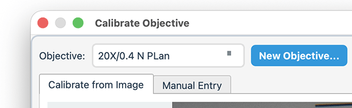
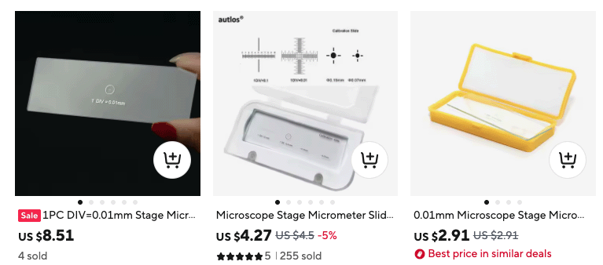
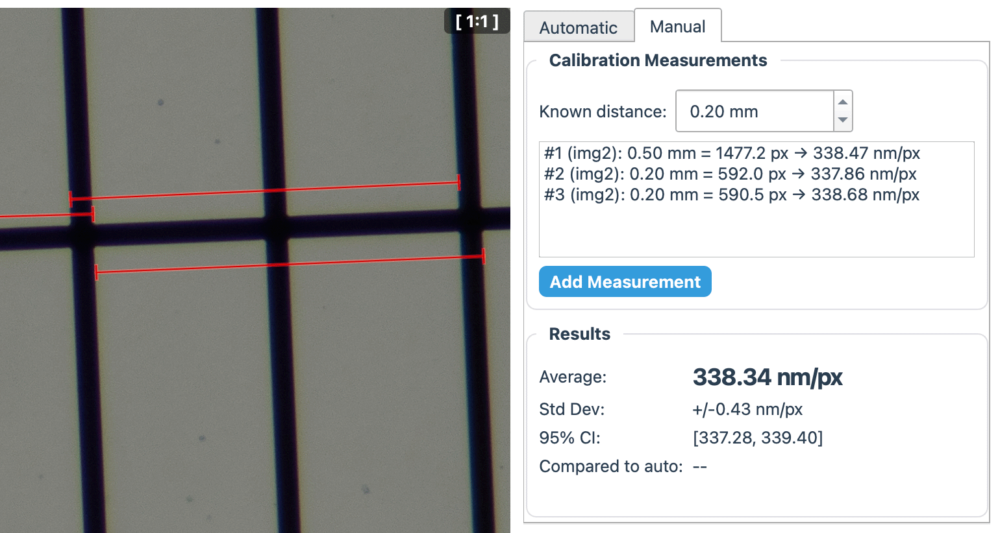
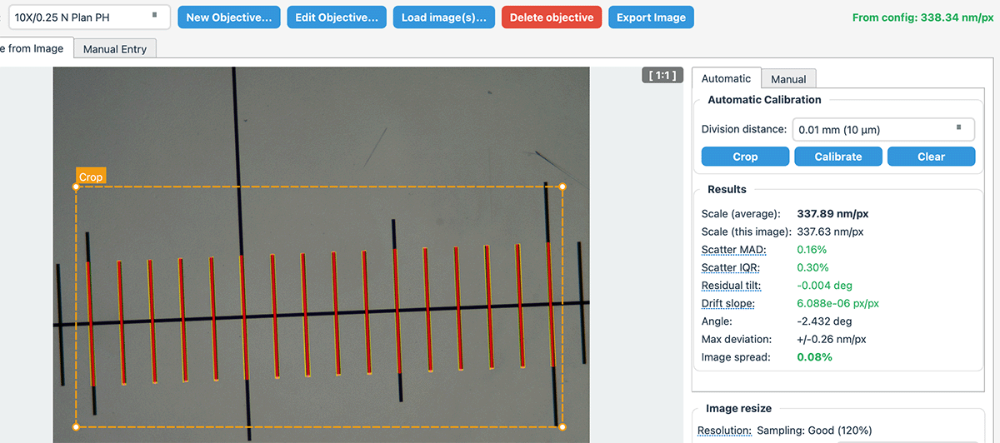
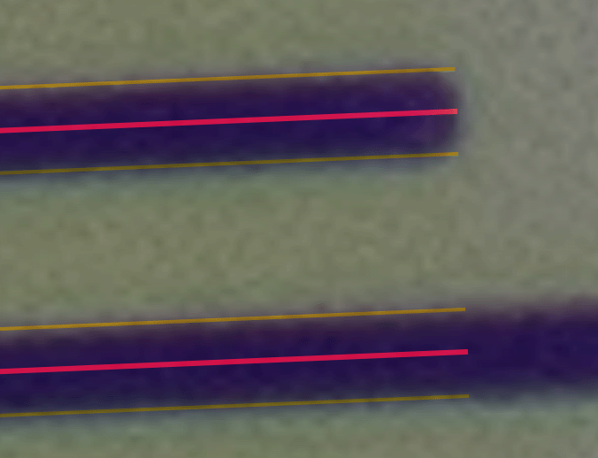

# Microscopy Workflow

## Objectives and Macro Profiles

Go to **Settings** → **Calibration** and pick an existing profile, or create **New Objective**:

**Microscope objectives** are defined by:
- Magnification
- Numerical Aperture (NA)
- Objective name/camera setup

**Macro lens profiles** (select profile type **Macro** in the New Objective dialog) are defined by:
- Magnification entered as a 1:X ratio (e.g. 1 for 1:1, 0.5 for 1:2)
- Sensor width (mm) and image width (px) for a provisional scale

The provisional scale formula is:

$$
p = \frac{\text{sensor width (mm)} \times 1000}{\text{image width (px)}} \times \frac{1}{\text{magnification}}
$$

This gives an approximate µm/px scale without a physical reference. For better accuracy, calibrate against a ruler or known reference length (same as microscope calibration).

You can also add a note about your setup, what camera or lens you're using etc.

## Calibration 

Calibrating a microscope requires a calibration slide, or "stage micrometer" for accurate results. See if you can borrow one from someone, or you can buy one from Aliexpress for very little money: 

### Manual calibration
 Pick one or more known distances in your image; start and stop location. Make sure you measure from the edge of a line to the same-side edge of another line. Like this:

Check the deviation on three different measurements and check that the deviation is acceptable.

### Automatic calibration
MycoLog recognizes horizontal or vertical lines. All you have to do is specify the line distance, then click ***Calibrate***.

You may have to select a cropped area if the lines are not uniform. Like here:

You will get some quality metrics, like MAD and IQR, that depend on the quality of the slide and your optics. If these numbers are way off (in red), the auto-calibration algorithm probably failed.

Check the overlay: 

The yellow lines show where the line edges have been detected. The red center lines are in the middle, between the edge lines. With poor contrast or insufficient resolution, the auto calibration may fail.

## Calibration history
This is handy if you change things in your setup, and you want to document past calibrations. The history stores:
- Camera model (from exif data)
- Megapixels
- Calibration scale and statistics

You can export the calibration image with overlays for documentation purposes.

## Prepare Images (Microscope)

In **Prepare Images**, set image type to **Micro** (keyboard shortcut: M) and pick the objective (or **Scale bar**) in the **Scale** group.

To set the same image type or scale on multiple images at once, **Ctrl+click** (or **Shift+click**) to select them in the gallery, then change the setting — it applies to all selected images.

For microscope images, the right panel shows:
- **Current resolution** (current MP and pixel dimensions)
- **Ideal sampling (% Nyquist)** (target sampling)
- **Ideal resolution** (target MP and pixel dimensions when resize is enabled)

Use **Resize to optimal sampling (R)** to preview and apply downsampling based on objective scale + NA + target sampling.

### Nyquist Sampling

MycoLog uses a Nyquist-based ideal pixel size:

$$
p_{\mathrm{ideal}} = \frac{\lambda}{4\,\mathrm{NA}}
$$

where $\lambda$ is the illumination wavelength in $\mathrm{\mu m}$ and $\mathrm{NA}$ is the numerical aperture. If you have a high-resolution sensor with a 100/1.25 objective, you could potentially reduce the image file size by quite a lot. As your database grows, and if you want to share your database with others, this file size reduction can be quite important.

### Downsampling and Scale Propagation

If an image is resampled by a uniform factor $f$, the scale
and megapixels adjust as follows:

$$
p_{\mathrm{target}} = \frac{p_{\mathrm{full}}}{f}, \qquad
M_{\mathrm{target}} = M_{\mathrm{full}} \cdot f^{2}
$$

where $f$ is the linear resampling factor ($0 < f \le 1$), $p_{\mathrm{full}}$ is the
original scale in $\mathrm{\mu m}/\mathrm{px}$, $p_{\mathrm{target}}$ is the resampled scale in $\mathrm{\mu m}/\mathrm{px}$,
$M_{\mathrm{full}}$ is the original megapixels, and $M_{\mathrm{target}}$ is the resampled megapixels.

MycoLog uses this relationship instead of requiring a second calibration on the
downsampled image.

## Resolution Mismatch Warning

The mismatch warning is still active, but only shown when all of these are true:
- Image type is microscope
- A normal objective is selected (not **Not set** or **Scale bar**)
- A calibration with usable resolution info exists
- The image/calibration resolution difference is large enough to matter

MycoLog compares calibration megapixels with the image megapixels and accounts for resize factor when relevant.  
A mismatch can be expected for heavily cropped images.

You may see this warning in both:
- **Measure** tab (Scale group)
- **Prepare Images** (Scale group)

## Prepare Images Shortcuts

- **F**: Set image type to Field
- **M**: Set image type to Micro
- **R**: Toggle "Resize to optimal sampling"
- **C**: Toggle AI crop mode
- **S**: Open "Set from scalebar"
- **Delete**: Remove selected image(s)

## Tab Navigation Shortcuts

Navigate between tabs from anywhere in the app:

| Action | Windows / Linux | macOS |
|--------|----------------|-------|
| Go to Observations | Alt+O | Option+O |
| Go to Measure | Alt+M | Option+M |
| Go to Analysis | Alt+A | Option+A |

## Appearance

The app follows the system dark/light mode automatically when **Settings → Appearance** is set to **Auto**. Changes take effect immediately without restarting.

## Working with Scale

- Select an objective in the Scale dropdown.
- Use **Set scale...** for custom scale bars.
- For microscope images, ensure the correct objective is applied before measuring.

## Scale Bar Calibration (Manual)

If you need a custom scale (field images or slides without an objective profile):

1. Choose **Scale bar** in the Scale dropdown.
2. Click **Set scale...** and enter the real-world length.
3. Click two points on the scale bar in the image.

You can also trigger this dialog from the **No Scale Set** prompt when you start measuring.

## See also

- [Field photography](./field-photography.md)
- [Spore measurements](./spore-measurements.md)
- [Taxonomy integration](./taxonomy-integration.md)
- [Database structure](./database-structure.md)
